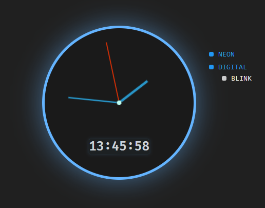

# js-analog-clock

CSS/JS/HTML analog clock with basic customization:

*   Neon light.
*   Digital clock.
*   Blinking separator.

## You can see it for yourself right [:globe_with_meridians: HERE](https://warchalowski.pl/pro/js-analog-clock/)

